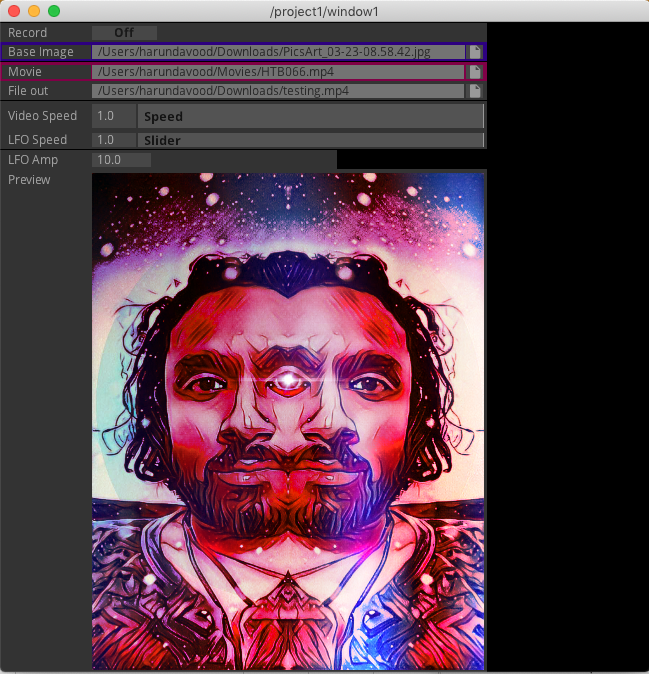

# Movie Overlay for Static Image
This project is used to learn interface design in TouchDesigner.

### Prerequisites
1. [TouchDesigner099](https://derivative.ca/)

### Getting Started:
1. Open .toe file
2. Start in performance mode
3. Select base image
4. Select movie overlay
5. Set movie out path
6. Adjust movie speed, LFO amplitude, and LFO speed settings
7. Hold down Record toggle button to record video

